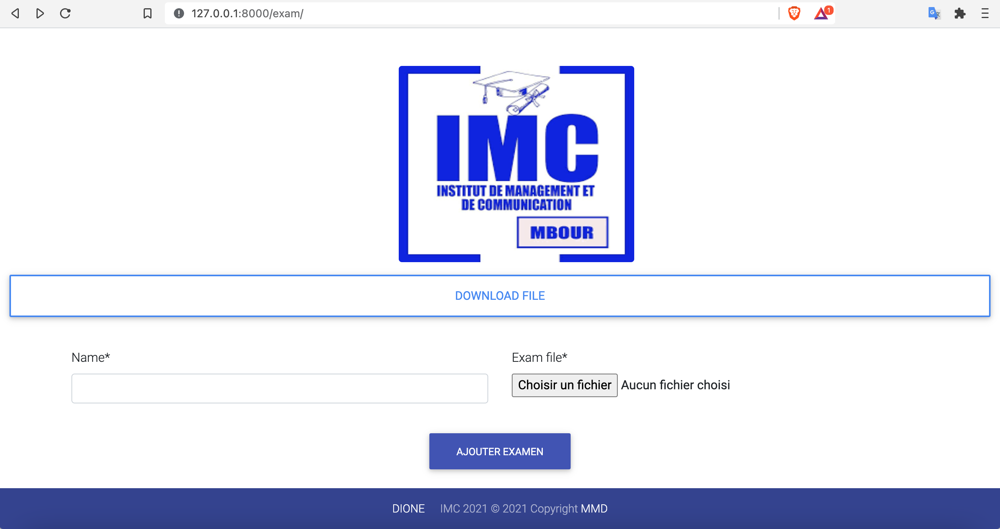

# Submit-exam

Permit students to upload there exam file directly when they're done
***
   
***

## How do I get set up?
* [Install Python](#1-Python-environment)
* [Clone Project](#2-Clone-repositorie)
* [Install required python packages](#3-Install-Packages)
* [Database migrations](#4-Apply-database-migrations)
* [Test local](#5-Run-the-app)
* [Troubleshooting](#6-Troubleshooting)


## 1 Python environment

The environement setup process depends on your system. Do some research to find out how to do it on OS.  
For MAC you can use the following commands  
```
pip install virtualenv
```

Create virtual environment
```
python -m virtualenv myenv
```
Active this env

```
Mac: source myenv/bin/activate
Windows: myenv\Scripts\activate.bat

```

## 2 Clone repositorie
Clone the repo and move to the project folder
```
git clone *repo_url*
cd Submit-exam

```

## 3 Install Packages
```

pip install -r requirements.txt

```

## 4 Apply database migrations
```
python manage.py makemigrations
python manage.py migrate
```

## 5 Run the app
Let’s start the development server and explore it.

```
python manage.py runserver

```
The api should now be running at http://127.0.0.1:8000/


## 6 Troubleshooting 

If there is any problem during the installation of the python package, just install each them one by one using   
```
pip install *package_name*. 
```
The most important packages are `django`, `django-allauth` and `django-crispy-forms`.

## Contact Information 
@mbayedione10  
mbayedione10@gmail.com  